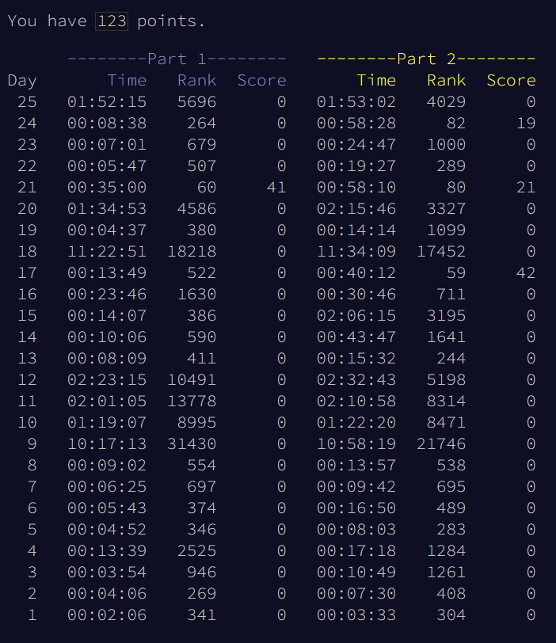

# Advent of Code 2024
## RobertJN64 Solutions

All solutions were written with no assistance from AI or forums.
Solutions are not necessarily optimal - but many use interesting
techniques.

The repo also contains the template file I used, as well as the scripts
to launch each part quickly.

Overall Thoughts:
 - AI made global leaderboard pretty pointless this year, except on some of the later puzzles
 - Puzzles were easier this year than in past years, especially compared to 2023, no crazy hard puzzles in the day20+ range
 - **First year I got all 50 stars!**
 - I loved day 17 (self replicating program) and day 21 (keypads)
 - The hidden refrences this year are great
 - The 2D grid puzzles are only outnumbered by the ADHD adventure puzzles where you solve a problem unrelated to the main quest

Thoughts on Puzzles:
 - Day 1: Great starter puzzles, solveable in Excel!
 - Day 2: Good introduction to list operations
 - Day 3: The regex puzzle - not generally a fan of "1 best solution" puzzles but I learned regex so that's cool
 - Day 4: Word search - annoying but the part2 reveal is so hilarious I'll let it slide - also the start of the "ADHD adventure" series of puzzles
 - Day 5: Fun sort algorithim implementation
 - Day 6: The looping guard puzzle - first real optimization challenge on part2
 - Day 7: Great use of permutations, although my recursive solution is nice as well
 - Day 8: Looked harder than it was, got burned by the overlap in the examples
 - Day 9: This one was weirdly hard for some reason, lots of solutions worked on some inputs and not on others
 - Day 10: Part2 was easier than part1, just removed my deduplication check, still ran fast enough
 - Day 11: First mandatory optimization on part2, but still not too hard (solved with functools cache)
 - Day 12: Area / perim, part1 was fun, part2 was a little annoying (couldn't think of an elegant solution)
 - Day 13: Part2 would have been a lot harder if someone hadn't yelled "its a system of equations!" while I was doing part1, solved with sympy
 - Day 14: The infamous Part2 picture, actually pretty fun to solve with matplotlib visualizations and some hueristics
 - Day 15: Part2 was brutal b/c of a subtle bug that only showed up 2k moves in
 - Day 16: Generic maze solving with a slight twist, very similar to day 10
 - Day 17: AWESOME Part2 (and not just because I got global leaderboard!)
 - Day 18: Very boring Part2 IMO - just more maze solving on a 2D grid
 - Day 19: Another fun optimization challenge in Part2 that was solveable with caching and I solved differently
 - Day 20: Very fun Part2, particulary when I figured out the final fast solution (and remembered to subtract the correct shortcut length)
 - Day 21: Another awesome puzzle, elegant recursive solution on part2
 - Day 22: I actually predicted a "RNG algorithm" puzzle, part2 was a little disappointing
 - Day 23: Generic graph theory stuff
 - Day 24: The part2 would have been harder if it wasn't just a simple adder circuit
 - Day 25: Very easy ending, but got me 50 stars!